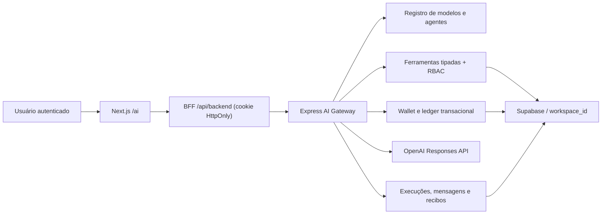

# 02 — Arquitetura NODERE AI-first

## Decisões

1. Segredos permanecem somente no backend/ambiente; o browser nunca recebe chave de provedor.
2. O registro de modelos é dado operacional no Postgres, não uma constante de UI.
3. A seleção padrão é GPT-5.6 Terra; Luna atende volume/custo e Sol tarefas frontier.
4. Toda geração reserva crédito antes do provedor e captura custo depois do uso real.
5. Ferramentas de escrita exigem aprovação e geram recibo idempotente.
6. O `workspace_id` vem da sessão verificada, nunca do payload do modelo ou do usuário.
7. O Dashboard permanece funcional, mas a home autenticada é a superfície conversacional `/ai`.
